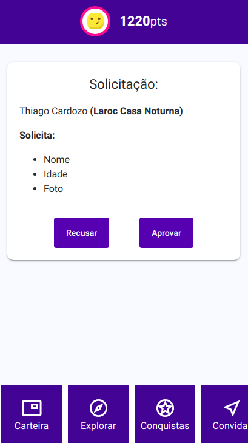

# DiDi App

## Decentralized Identity Intelligence

### Appearance

    

***

### Know DiDi

- Self-sovereign decentralized identity
- Identity score
- Exchange of identity without friction
- Solutions Marketplace

***
### Architecture for Global Scale

-  [HYPERLEDGER INDY](https://www.hyperledger.org/projects/hyperledger-indy)

-  [r3. corda](https://www.corda.net/index.html)
  
***
### Requisítos

- xTerm.
- Java 8.
- Angular 7.2.14
- Typescript 3.4
- Node 8.10

***

### Instalação

Para começarmos primeiro clone nosso reposítorio seguindo o comando a baixo. 

```# git clone https://github.com/CPqD/inovathon-10.git```

Vai ser gerado uma pasta com nome inovathon-10. Entre nessa diretório que foi clonado.

```# cd /inovathon-10/```

Nesta pasta está os arquivos necessários para a aplicação funcionar. Agora vamos entrar na pasta ExampleCorda, ela contém nosso back-end, os arquivos para o Corda e o indy funcionarem.  

```$ cd /inovathon-10/ExampleCorda/```

Vamos executar esse comando para criar a pasta build do projeto, nela vamos ter os nós.

```# ./gradlew deployNodes```

Entrando na pasta build e depois na pasta nodes,

```$ cd build/nodes```

Temos um script para inicar o Nó A e B, o webService A e B, e o Notário.

```# ./runnodes```

Agora temos nosso Back-end operacional. Vamos agora instalar e iniciar o Front-end.
Começamos voltando para inicial do diretório /inovathon-10. E entramos na pasta front.

```$ cd /inovathon-10/front/```

Aqui rodamos o comando npm install, para instalar todas as dependências para conseguirmos executar.

```$ npm install```

E por último subimos nossa aplicação com o comando a baixo.

```$ ng serve``` ou ```$ npm start```

***
