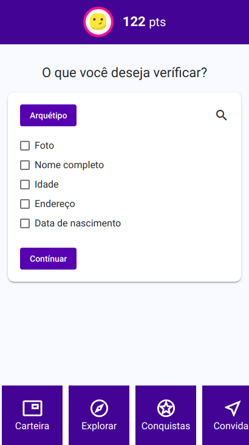

# DiDi App

## Decentralized Identity Intelligence

### Appearance

    

***

### Know DiDi

- Self-sovereign decentralized identity
- Identity score
- Exchange of identity without friction
- Solutions Marketplace

***
### Architecture for Global Scale

-  [HYPERLEDGER INDY](https://www.hyperledger.org/projects/hyperledger-indy)

-  [r3. corda](https://www.corda.net/index.html)
  
***

### Installation

#### Front-end
This project uses Angular.
```
- ng build --sourcemaps --base-href producao/
```
```
- Install command.
```
```
- Install command.
```
```
- Install command.
```

#### Back-end
```
- Install command.
```
```
- Install command.
```
```
- Install command.
```
```
- Install command.
```
***
